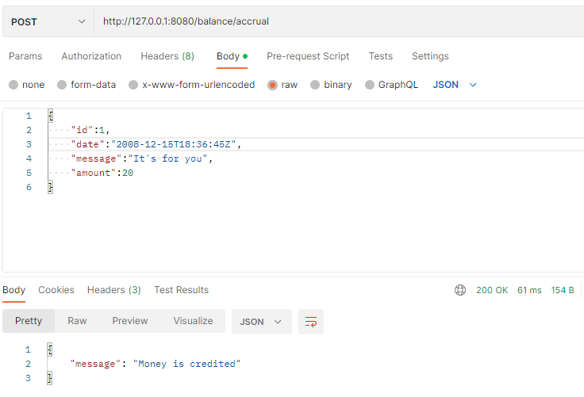

## Микросервис для работы с балансом пользователей

### Этапы обработки запроса

1. handlers - принимаем запрос, проверяет входные данные на валидность, вызывает нужный сервис
2. service - обрабатывает запрос, делает логическую проверку данных (например: баланс не ушел в минус), вызывает функции
   для работы с базой данных
3. repository - работает непосредственно с базой данных

### Структура базы данных

* Таблица balance - содержит данные о балансе пользователя:
    * int, primary_key: id - id пользователя
    * real: balance - баланс пользователя
* Таблица reservation - содержит данные о резервированных средствах:
    * int, primary_key: id_user - id пользователя
    * int, primary_key: id_service - id сервиса
    * int, primary_key: id_order - id заказа
    * int: amount - количество средств
    * text: status - статус резерва:
        * RESERVED - зарезервировано
        * CONFIRMED - подтверждено
        * CANCELED - отменено
    * text: date - последняя дата изменения статуса
* Таблица history - содержит историю транзакций пользователей:
    * int, primary_key: id_user - id пользователя
    * text, primary_key: date - дата и время транзакци
    * real: amount - сумма транзкации
    * text: message - комментарий
* Таблица reports - содержит данные о готовых отчетов для бугалтерии
* text, primary_key: date - месяц и год отчета
* text: link - путь к файлу отчета

### Реализованные запросы

* POST: /balance/accrual - Начисление средств пользователю
* POST: /balance/send - Перевод средств от пользователя к пользователю
* GET: /balance/balance - Информация о балансе
* POST: /order/reserve - Резервирование средств
* POST: /order/cancel - Отмена резервирования
* POST: /order/confirm - Признание средств
* GET: /report - Формирование отчета для бугалтерии
* GET: /history - История транзакций пользователя

Доп. информация в файле [swagger.yaml](./swagger.yaml)
### Используемые библитеки
* sqlx
* gin

### Запуск
билд: docker-compose -f docker-compose.yaml build

запуск: docker-compose -f docker-compose.yaml up

Сервер работает на порту 8080

### Мои вопросы и мои ответы
* При признании средств всегда ли ВСЕ средства признаются? Ответ: да
* Как оформляется метод получения отчета для бугалтерии? Ответ: отпраляется API запрос /report с указанием 
месяца и года отчета. Сервер компилирует отчет и кладет его рядом с файлами севера(можно настроить в docker-compose), если он не был сформирован ранее, или берет готовый из базы данных(Таблица reports), 
после чего возвращает путь к файлу.
* Отчет создается только за прошлые месяца. Поэтому, если запросить отчет один раз, сервер его создаст и сохранит ссылку в базе данных
, а после при запросе отчета за тот же месяц будет возвращать ссылку, сохраненную в базе данных.
* Отражается ли резервирование средств на историю транзакций пользователя? Ответ: само резервирование, как и его отмена, не отображается,
только после подтверждения данные вносятся в историю.

### Примеры

Запрос баланса 
```json
{
  "id": 1
}
```

Пополнение средств
```json
{
  "id":1,
  "date":"2008-12-15T18:36:45Z",
  "message":"It's for you",
  "amount":20
}
```

Резервирование
```json
{
  "idUser":15,
  "date":"2008-12-18T18:36:45Z",
  "idService":4,
  "idOrder":5,
  "amount": 5
}
```

Резервирование при нехватке средств

Подтверждение
```json
{
  "idUser":15,
  "date":"2008-12-19T18:36:45Z",
  "idService":4,
  "idOrder":5,
  "amount": 5,
  "message": "confirmed by me"
}
```

Попытка подтверждения при отсутсвии данного резерва

История: отсортировано по сумме в порядке убывания, первые 3 элемента
```json
{
  "id":1,
  "sortType":"amount",
  "orderType": "desc",
  "amount":3,
  "offset":0
}
```
```
{
    "history": [
        {
            "date": "2008-10-14T18:36:45Z",
            "amount": 50,
            "message": "for you"
        },
        {
            "date": "2008-11-14T18:36:45Z",
            "amount": 30,
            "message": "Surprise"
        },
        {
            "date": "2008-11-15T18:36:45Z",
            "amount": 20,
            "message": "Hello"
        }
    ]
}
```

История: отсортировано по сумме в порядке убывания, первые 3 элемента, пропуская первый
```json
{
  "id":1,
  "sortType":"amount",
  "orderType": "desc",
  "amount":3,
  "offset":1
}
```
```
{
    "history": [
        {
            "date": "2008-11-14T18:36:45Z",
            "amount": 30,
            "message": "Surprise"
        },
        {
            "date": "2008-11-15T18:36:45Z",
            "amount": 20,
            "message": "Hello"
        },
        {
            "date": "2008-12-15T18:36:45Z",
            "amount": 20,
            "message": "It's for you"
        }
    ]
}
```

Получение ссылки на отчет
```json
{
  "month":10,
  "year":2008
}
```
